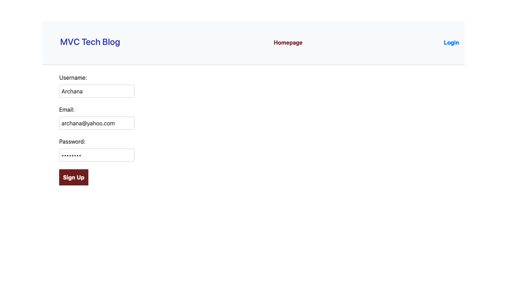
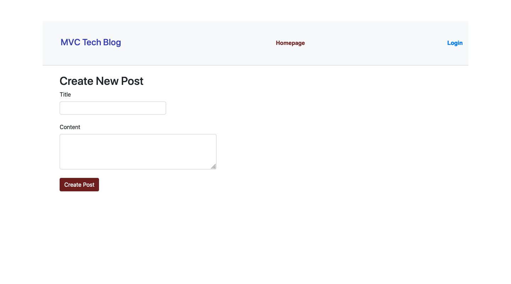
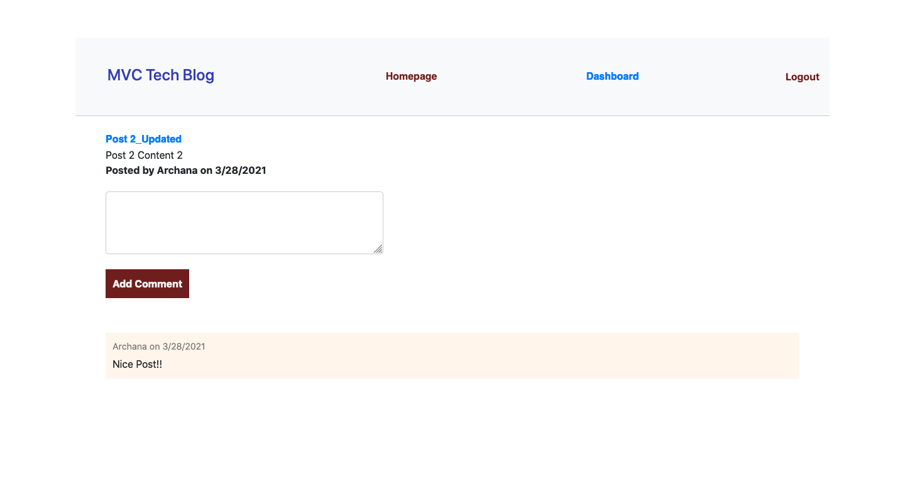
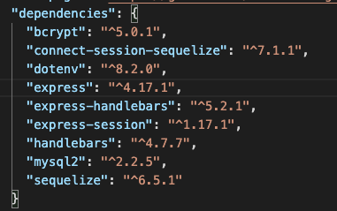

# MVC-Tech-blog

## Description

An CMS-style blog site similar to a Wordpress site, where developers can publish their blog posts and comment on other developers’ posts as well.

## Table of Contents

* [Description](#description)
* [Deployment](#deployment)
* [Technologies](#technologies)
* [Installation](#installation)
* [License](#license)
* [Questions](#questions)

## Deployment 
* The app is deployed in heroky at https://stark-journey-61935.herokuapp.com/

### Screenshots 
* 
* 
* 

## Technologies

* 
* Node.js, Express.js, Sequelize, mysql2, connection-session/express-session and  Jest

## Installation

* Git clone the repo 

* Install npm by running the following in terminal
    - npm install

* Sql commands
    - mysql -u root -p
    - source db/schema.sql

* Run the app
    npm start

## License

This repository is licensed under the [MIT license](./LICENSE).

## Questions

For any questions about the project/repository please contact me @ [archana.nagaraj@gmail.com](mailto:archana.nagaraj@gmail.com)  
GitHub @ [archana-nagaraj](https://github.com/archana-nagaraj) 